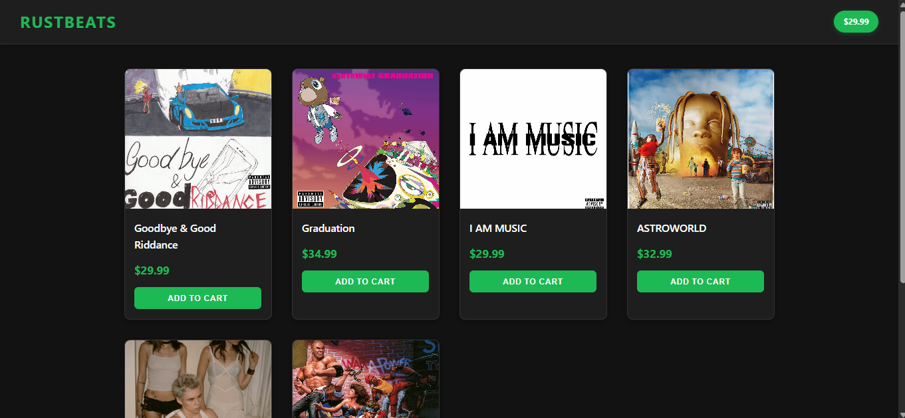

# 🎵 RustMart - Music Store SPA



A modern Single Page Application (SPA) built with Rust + WebAssembly + Yew framework, demonstrating the power of Rust in web development. This project showcases a music album store with dynamic routing, state management, and WebAssembly performance.

[](https://opensource.org/licenses/MIT)
[](https://www.rust-lang.org/)
[](https://yew.rs/)


## 🎯 Features

- **Modern SPA Architecture**: Built using Yew's component-based framework
- **WebAssembly Powered**: Rust compiled to WASM for near-native performance
- **Dynamic Routing**: Using `yew-router` for seamless navigation
- **State Management**: Efficient state handling with Yew's component state
- **RESTful API Integration**: JSON-based product data handling
- **Responsive Design**: Mobile-friendly interface
- **Component Features**:
  - Dynamic Product Catalog
  - Shopping Cart Management
  - Product Detail Views
  - Interactive Navigation Bar
  - Add to Cart Functionality

## 🛠️ Technical Stack

- **Frontend Framework**: [Yew](https://yew.rs/) v0.17
- **Routing**: yew-router v0.14
- **WebAssembly Binding**: wasm-bindgen v0.2
- **State Management**: Yew component state
- **Logging**: wasm-logger
- **Error Handling**: anyhow
- **Serialization**: serde
- **Build Tools**: Cargo + wasm-pack
- **Development Server**: Node.js

## 📁 Project Structure

```
rustmart/
├── src/
│   ├── components/           # Reusable UI components
│   │   ├── atc_button.rs    # Add to Cart button component
│   │   ├── navbar.rs        # Navigation bar component
│   │   └── product_card.rs  # Product display component
│   ├── pages/               # Page components
│   │   ├── home.rs         # Home page
│   │   └── product_detail.rs # Product detail page
│   ├── api.rs              # API interaction logic
│   ├── app.rs              # Main application component
│   ├── route.rs            # Routing configuration
│   ├── types.rs            # Type definitions
│   └── lib.rs              # Library root
├── static/                 # Static assets
│   ├── products/          # Product images and data
│   ├── styles.css         # Application styles
│   └── index.html         # HTML entry point
└── Cargo.toml             # Rust dependencies and config
```

## 🚀 Getting Started

### Prerequisites

```bash
# Install Rust
curl --proto '=https' --tlsv1.2 -sSf https://sh.rustup.rs | sh

# Add WebAssembly target
rustup target add wasm32-unknown-unknown

# Install wasm-pack
cargo install wasm-pack

# Install Node.js and npm (for development server)
# Download from https://nodejs.org/
```

### Development Setup

1. **Clone the repository**
```bash
git clone https://github.com/yourusername/rustmart.git
cd rustmart
```

2. **Install dependencies**
```bash
# Install Rust dependencies
cargo check

# Install npm dependencies
cd static
npm install
```

3. **Run the development server**
```bash
# Build WASM package
wasm-pack build

# Start development server
npm start
```

4. Open `http://localhost:3000` in your browser

## 🔧 Building for Production

```bash
# Build optimized WASM bundle
wasm-pack build --release

# Bundle static assets
cd static
npm run build
```

## 🧪 Testing

```bash
cargo test
wasm-pack test --headless --firefox
```

## 📝 Implementation Details

- **Routing**: Implemented using `yew-router` for client-side navigation
- **State Management**: Uses Yew's component-based state management
- **API Integration**: JSON-based product data with asynchronous loading
- **Component Architecture**: Modular design with reusable components
- **WebAssembly Integration**: Direct DOM manipulation through wasm-bindgen


## 📜 License

This project is licensed under the MIT License - see the [LICENSE](LICENSE) file for details.

## 🙏 Acknowledgments

- [Yew Framework](https://yew.rs/) for providing an excellent Rust web framework
- [WebAssembly](https://webassembly.org/) for enabling high-performance web applications
- The Rust community for their invaluable resources and support

---

> 🔍 **Note**: To add a banner image to your GitHub repository, create a `screenshots` directory and add application screenshots there. Then update the banner image path in this README.

Built with ❤️ using Rust + WebAssembly + Yew
